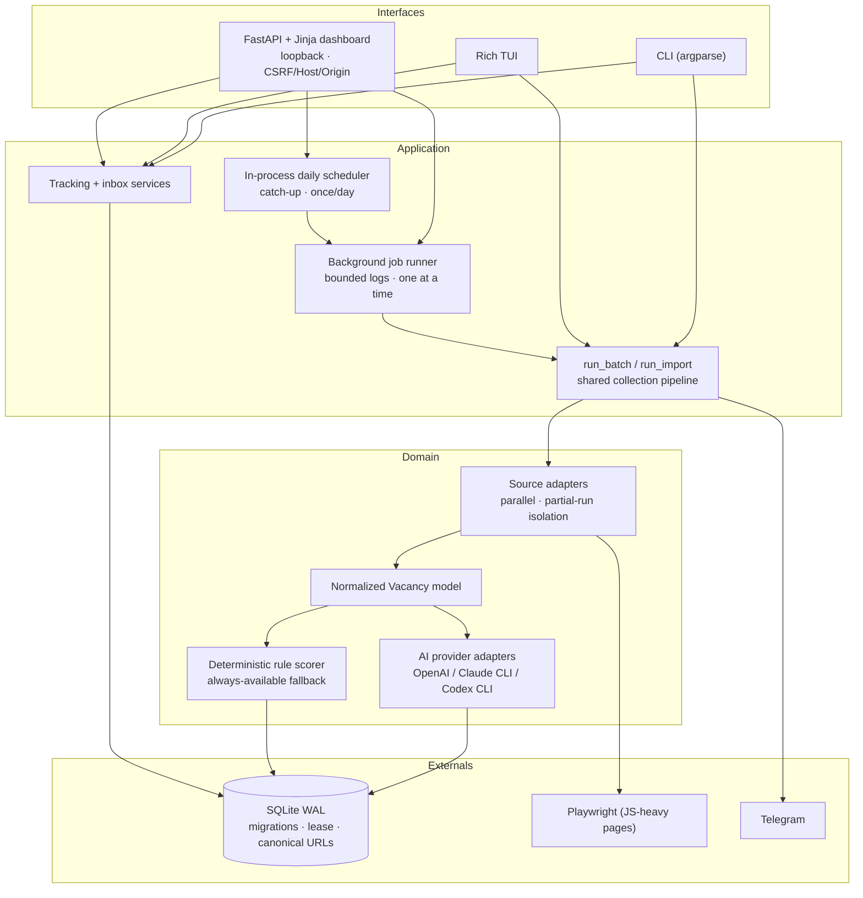

# Job Seeker Intelligence

A local-first job-search engine that ingests vacancies from unreliable external job boards, normalizes them into one model, ranks them with pluggable AI providers behind a deterministic fallback, and serves the result through a secured loopback web dashboard, a Rich terminal UI, and a CLI — all backed by a single, self-migrating SQLite database.

**Stack:** Python 3.12 · FastAPI · Jinja2 · SQLite (WAL) · Playwright · OpenAI / Claude CLI / Codex CLI adapters · Rich · threaded background jobs · Ruff · GitHub Actions

> **See it running in 30 seconds — no API keys, no accounts, no network calls:**
>
> ```bash
> python -m pip install -e ".[dev]"
> python main.py --demo --web        # seeds a throwaway DB from fixtures, opens the dashboard
> ```
>
> `--demo` populates a disposable database from bundled sample fixtures using deterministic rule-based scoring and opens the dashboard at <http://127.0.0.1:8000/>. It never touches your real config or data. Drop `--web` to just seed and inspect from the CLI.

---

## What it demonstrates

- **Resilient ingestion from flaky third-party sources.** Every board is isolated behind an adapter; enabled sources run in parallel while requests stay sequential *within* a source; one failing board yields a **partial run** instead of aborting the whole batch.
- **A provider-agnostic AI layer.** OpenAI, the Claude CLI, and the Codex CLI sit behind one small `Protocol`. Untrusted model output is defensively validated and clamped, and a deterministic rule engine is always available as the fallback — so the app never depends on any one provider being up or well-behaved.
- **Deliberate state & failure handling.** SQLite in WAL mode, backed-up schema migrations, integrity/foreign-key checks at bootstrap, a per-database **collection-run lease** that prevents overlapping writers, and canonical-URL identity for de-duplication.
- **A consciously secured local web surface.** Loopback-only bind with Host/Origin validation and SameSite-strict CSRF on every mutation, plus explicit size and path trust boundaries on file upload and profile save — "loopback" is treated as a reason to be careful, not an excuse.
- **Operational thinking.** An always-on launcher, an in-process daily scheduler with catch-up and once-per-day de-duplication, background jobs with bounded logs and retention, and Telegram delivery of new high-scoring matches.
- **One domain, three interfaces.** The CLI, the Rich TUI, and the FastAPI dashboard are thin surfaces over the same shared run/import/tracking services — not three parallel implementations.
- **Reproducibility.** A zero-config offline demo and a CI gate that runs Ruff, the full unit suite, and a `--demo` smoke test with no credentials present.

## Architecture



The interfaces do not re-implement collection or tracking; they call the shared pipeline (`run_batch` / `run_import`) and the tracking/inbox services, which own the domain logic.

## Engineering highlights

| Decision | Where | Why it's interesting |
| --- | --- | --- |
| **Partial-run isolation across parallel sources** | `main.py` (`_execute_source_batches`), `sources/` | Sources run concurrently in a thread pool; a raised adapter fault is captured per source and folded into a `partial` run status rather than failing the batch. Users can always tell recommendations came from an incomplete collection. |
| **Provider abstraction + deterministic fallback** | `analysis.py`, `ai_cli.py` | One `AIAnalysisClient` Protocol; `VacancyAnalysisService` runs a primary strategy and falls back to rule-based scoring on *any* failure — including a primary that returns structurally incomplete output (caught at build time, not just call time). |
| **Defensive validation of untrusted model output** | `ai_cli.coerce_score` / `coerce_str_list`, `analysis.normalize_analysis_result`, `extraction.normalize_extraction_result` | Model responses are treated as hostile input: scores are parsed and clamped to `0–100` (tolerating strings/`None`/`bool`), list fields are forced to lists of non-empty strings, and non-object payloads collapse to defaults — no `KeyError`/`TypeError` reaches the pipeline. |
| **Collection-run lease** | `storage.py` (`begin_collection_run`) | A per-database lease makes overlapping writers impossible; a second run exits with a distinct code instead of corrupting shared state. |
| **Backed-up, integrity-checked migrations** | `storage.py` (bootstrap) | WAL mode, a lock-file-serialized migration path, a timestamped backup taken before any schema change, and `PRAGMA integrity_check`/foreign-key checks that halt startup before serving bad data. |
| **Canonical-URL identity** | `storage.canonicalize_source_url` | Tracking params (`utm_*`, …) are stripped for duplicate identity while the original URL is preserved via alias data — dedup without losing provenance. |
| **Local web security boundary** | `web.py` | Loopback-only bind validation, Host + Origin checks, SameSite-strict CSRF (with a multipart-aware variant for uploads), a bounded upload read, and a save-path resolver that rejects absolute/`..` escapes. |
| **In-process scheduler over machine time** | `web_scheduler.py` | Fires at most once per local day at/after a chosen time with catch-up, records last-run bookkeeping, and loads crash-proof against a corrupted `scheduler.json`. Time semantics are explicit and the clock is injectable for tests. |

## Quick start

Requirements: **Python 3.12+**. Browser-mode sources additionally need Playwright Chromium.

```bash
git clone https://github.com/Yashelly/job-application-agent.git
cd job-application-agent
python -m venv .venv
# Windows: .\.venv\Scripts\Activate.ps1   |   POSIX: source .venv/bin/activate
python -m pip install -e ".[dev]"
python -m playwright install chromium     # optional: only for browser-mode sources

python main.py --demo --web               # offline demo, no keys needed
```

The editable install also adds a `job-seeker` console command (equivalent to `python main.py`).

## AI architecture

The rest of the application does not know or care which AI provider is active. A single Protocol defines `analyze(vacancy, profile) -> dict`; concrete adapters wrap each backend and hand back a normalized dict; the analysis service turns that into a validated domain object.

```
AI_BACKEND env  ─▶  provider adapter (OpenAI API │ claude CLI │ codex CLI)
                       ─▶  tolerant JSON parse + defensive normalization
                             ─▶  VacancyAnalysisService (+ rule-based fallback)
                                   ─▶  validated VacancyAnalysis  ─▶  app logic
```

| `AI_BACKEND` | Uses | Auth |
| --- | --- | --- |
| `claude_cli` | Local `claude` CLI (Claude Code) | Your Claude subscription login |
| `codex_cli` | Local `codex` CLI | Your ChatGPT (Codex) subscription login |
| `openai` | OpenAI API | `OPENAI_API_KEY` |
| `rule` | Deterministic profile-keyword scoring | None (offline) |
| `demo` | Offline showcase client (rule scoring + small boost) | None (offline) |
| _(unset)_ | `openai` if a key is present, else `rule` | — |

- The CLI backends **shell out with explicit timeouts** and tolerate fenced/prose-wrapped JSON; a missing CLI, non-zero exit, or timeout raises a typed error that the analysis service catches and falls back on.
- AI analysis **always degrades to rule-based scoring** if a backend fails, so tests and the sample/demo workflow stay fully offline.
- The backend can be switched at runtime from the dashboard (Settings/Profile); it updates `AI_BACKEND` for the running process. Model overrides: `--openai-model`, `CLAUDE_CLI_MODEL`, `CODEX_CLI_MODEL`.

Building a profile from a CV (`/profile` upload, or TUI menu `10`) requires an AI backend; the offline backends show guidance instead of guessing. Uploads are size-capped and written to a temp file that is deleted immediately after text extraction; PDF/DOCX use `pypdf`/`python-docx`.

## Reliability & data model

- **Collection runs** are recorded with `running`/`completed`/`partial`/`failed` status; a per-database lease prevents overlap. A stale `running` row (e.g. from a killed process) makes later runs exit `3` (`COLLECTION RUN ACTIVE`) until the row is marked `failed`.
- **Vacancy identity** uses canonical URLs (tracking params removed); original URLs are retained as aliases. First-seen/last-seen run IDs and timestamps are tracked per vacancy.
- **The explained inbox** joins vacancy data, latest analysis, application status, run membership, and a **single shared preference row** used identically by CLI, TUI, and web — this is exactly what "Shared inbox and reminder settings" on the Settings page edits, so a change made anywhere applies everywhere.
- **Applications** move through `Saved → Applied → Interview → Offer → Rejected → Withdrawn` with guarded transitions; corrective jumps require a recorded reason and become audit events.
- **Actions/reminders** are entered as local ISO datetimes, stored as UTC `Z` instants, and rendered back through the configured/detected IANA timezone. DST is handled explicitly: nonexistent spring-forward times are rejected; ambiguous fall-back times require an explicit fold.
- **Bootstrap** enables WAL, serializes migrations with a lock file, takes a timestamped backup before any migration, and runs integrity/foreign-key checks that halt before serving on failure.
- Relative DB paths from YAML are anchored to the config directory; the example config declares `db: job_seeker.db`, so an auto-config launch uses `config/job_seeker.db`.

## Testing & CI

```bash
python -m unittest discover -s tests -p "test_*.py"   # full suite
python -m ruff check src tests                          # lint gate
python main.py --demo                                   # offline smoke test (no credentials)
```

The suite (230+ tests) covers parsers and source adapters (including browser-mode wiring), storage bootstrap/migrations, canonical-URL behavior, collection-run leases, inbox preferences, status-transition audit events, DST/timezone conversion, CLI database commands, TUI adapters, web dashboard security/rendering, the scheduler (including corrupted-config recovery), background-job bounds, subscription-CLI runners, defensive AI-output normalization + fallback, CV profile building, Telegram formatting, dependency pins, and the offline demo.

GitHub Actions (Python 3.12) verifies clean dependency resolution, runs Ruff over `src` and `tests`, runs the unit suite with `OPENAI_API_KEY` empty, and executes `--demo` to prove the offline path works with no credentials. The Ruff config is pinned in `pyproject.toml` so the gate is reproducible rather than falling back to editor defaults.

## Screenshots

Real screenshots are not committed to keep the repo lean. To capture a deterministic set from the reproducible demo data (no keys, same fixtures every time):

```bash
python main.py --demo --web
# then open http://127.0.0.1:8000/ and capture: /today, /vacancies, a /vacancy detail,
# /applications, /schedule, /profile, and a running /jobs/{id} page.
```

Because the demo seeds identical fixtures on every run, these views are stable across machines. Drop captures under `docs/screenshots/` if you want them rendered here.

## Detailed usage

### Web dashboard (run by hand)

```bash
python main.py --web                                   # 127.0.0.1:8000
python main.py --web --web-host 127.0.0.1 --web-port 8765
```

Custom binds must stay loopback-only; wildcard/LAN/public hosts are rejected before Uvicorn starts. Pages: **Today** / **Vacancies** / vacancy detail (explained inbox), **Search** (background collection), **Profile** (active profile + AI backend, CV upload, URL import), **Applications** (tracking + actions/reminders), **Schedule** (daily run + Telegram), **Settings** (shared inbox filters, timezone, backend switch), and live **Jobs** progress pages. One background job runs at a time; job logs are bounded and history is pruned.

### Rich TUI and CLI

Run with no arguments for the TUI. The CLI mirrors it for scripting:

```bash
job-seeker --sources cvbankas,hh,justjoin --keywords "n8n;AI automation" --limit 5 --max-pages 2
job-seeker --source sample --limit 2 --export exports/sample_report.md
job-seeker --import-urls-file imports/vacancy_urls.txt --analysis-strategy rule
job-seeker --inbox --inbox-min-score 80 --inbox-hide-below-threshold --save-inbox-preferences
job-seeker --vacancy-url "<url>" --status applied --note "Applied with tailored CV"
job-seeker --list-tracked
job-seeker --today
```

Exit codes: `0` useful output / rows written, `2` no matching rows or no new vacancies, `3` another run holds the database lease. See `job-seeker --help` for the full option set.

### CV-Online full-feed crawl

> **CV-Online collection rule — database required.** Do **not** collect this source with keywords, filters, or a pasted `--listing-url`: its public live-search filters are unreliable and are rejected by the adapter. `cvonline` always reads the unfiltered newest-first public feed (100 vacancies per page). SQLite is the source of truth for incremental collection: after the bootstrap it compares public vacancy URLs to the local database and processes only unseen ones.

This source therefore has two explicit stages: full-feed bootstrap, then database-backed daily collection.

```bash
# First run: crawl all active CV-Online listings.  Matches at/above 40 are Saved.
job-seeker --config config/cvonline.example.yaml --infinite

# Later runs: fetch the newest 100 listings only, skip URLs already in SQLite,
# score/save only unseen vacancies, and send the Telegram daily summary.
job-seeker --config config/cvonline.example.yaml --daily-run
```

The dashboard also exposes `cvonline` as a source. For the initial import tick **Infinite search**; configure the daily scheduler with `cvonline`, one listing page, and a suitable limit. Scheduled runs auto-save scores at/above 40.

### Daily Telegram summary

The daily run collects configured sources once, keeps only vacancies not already in SQLite, and sends the top new matches to Telegram.

1. Create a bot with [BotFather](https://t.me/BotFather); put `TELEGRAM_BOT_TOKEN=…` in `.env`.
2. `job-seeker --telegram-chat-id` to discover your chat ID; add `TELEGRAM_CHAT_ID=…`.
3. `job-seeker --telegram-test`, then `job-seeker --daily-run`.

Schedule it either from the dashboard (**Schedule** page — in-process scheduler, no admin, persisted in `scheduler.json`) **or** with the Windows task below — not both.

### Always-on dashboard (Windows)

Keeps the dashboard available across reboots. It starts at **logon** and **runs as you** (not `SYSTEM`) so your `claude`/`codex` CLI logins are available, and stays loopback-only.

```powershell
# No admin (Startup-folder .vbs launcher; recommended):
powershell -ExecutionPolicy Bypass -File scripts\install_dashboard_startup.ps1 -Port 8000
powershell -ExecutionPolicy Bypass -File scripts\uninstall_dashboard_startup.ps1

# With restart-on-failure (elevated PowerShell required):
powershell -ExecutionPolicy Bypass -File scripts\install_dashboard_service.ps1 -Port 8000
```

`scripts\run_dashboard.ps1` is the launcher both call; it logs to `logs\dashboard.log`. Allow ~10s after logon for the port to answer. The launcher relaxes `$ErrorActionPreference` to `Continue` because Uvicorn logs to stderr, which under `Stop` would be promoted to a terminating error before the server binds.

### Configuration

```powershell
Copy-Item config\cvbankas.example.yaml config\cvbankas.local.yaml
```

The app prefers `config/cvbankas.local.yaml`; TUI changes persist there. Per-source options live under `sources.options.<id>` (`fetch_mode`, `browser_headless`, `browser_fresh_context`, …).

## Sources

| Source | ID | Collection | Notes |
| --- | --- | --- | --- |
| CVbankas | `cvbankas` | HTML parsing | LT/EN automation & AI keywords |
| HH.ru | `hh` | Playwright | Remote roles, throttled |
| JustJoin.it | `justjoin` | HTML parsing | EN automation/AI/tooling |
| Startup Jobs | `startup_jobs` | Playwright | Startup AI/automation |
| EU Remote Jobs | `euremotejobs` | Playwright | Remote EU, throttled |
| Sample fixtures | `sample` | Local HTML | Offline demo/tests |
| Direct URLs | — | Batch import | Newline/space/comma separated |

Each source is isolated behind an adapter so a broken provider degrades to a partial run. **Browser mode** exists to render JS-dependent public pages (e.g. `startup_jobs`, `euremotejobs`) via a real headless Chromium instead of a plain HTTP fetch; it is slower, and a site that later requires interactive verification (e.g. a CAPTCHA/Turnstile challenge) can still block it. It is not an anti-bot bypass and is not guaranteed to keep working as sites change.

## Known constraints

- Public job-board HTML and access rules change without notice; browser-mode sources can break when a board changes or adds interactive verification.
- SQLite is intentional: local, single-user, not for concurrent multi-user web access.
- The dashboard is loopback-only with no login by design; it is not an internet-facing service.
- AI analysis is optional and never required for tests; there is no automated application-submission flow — tracking records what you do elsewhere.

## Roadmap

Source-health metrics and run-history summaries in the UI; stronger cross-source duplicate detection beyond URL canonicalization; richer saved searches/filters; full-database export from the TUI; a packaged Windows release; optional calendar/email reminder integrations once the local workflow is stable.

## License

No license file is currently included, which means default "all rights reserved" applies. Choosing a license (e.g. MIT for a permissive portfolio project, or none) is a decision left to the repository owner.
