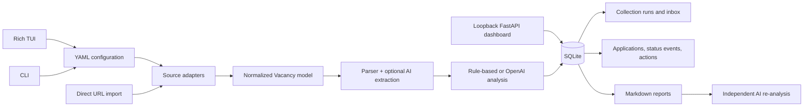

# Job Seeker Intelligence

Multi-source job discovery, ranking, and application tracking for a local-first job search workflow.

The project collects vacancies from several job boards or pasted direct URLs, normalizes them into a shared model, stores them in SQLite, ranks them with deterministic rules or optional OpenAI analysis, and exposes the results through a Rich terminal UI, a command-line interface, Markdown exports, Telegram summaries, and a loopback-only web dashboard.

## Why It Exists

Automation and applied AI roles are difficult to find with one generic search query. The same type of work may be advertised as workflow automation, RPA, AI integration, internal tools, no-code, low-code, or under tools such as n8n, Make, Zapier, Power Automate, or UiPath.

Job Seeker Intelligence solves this by:

- using shared YAML configuration with source-specific keyword packs;
- collecting vacancies from regional, remote, startup, and direct-URL sources;
- running enabled sources in parallel while keeping requests sequential inside each source;
- preserving source identity while canonicalizing URLs for duplicate detection;
- enriching parser output into one vacancy model before analysis;
- skipping already processed URLs by default, with `--refresh` available when needed;
- ranking vacancies with local rules or optional OpenAI-backed extraction and scoring;
- tracking applications, status history, actions, reminders, and inbox preferences in SQLite;
- exporting self-contained Markdown reports that another AI can re-analyze independently.

## Current Sources

| Source | CLI ID | Collection method | Search behavior |
| --- | --- | --- |
| CVbankas | `cvbankas` | HTML parsing | Lithuanian and English automation/AI keywords |
| HH.ru | `hh` | Playwright browser session | Remote roles outside Russia and Belarus, with throttled requests |
| JustJoin.it | `justjoin` | HTML parsing | English automation, AI, integration, and tooling keywords |
| Startup Jobs | `startup_jobs` | HTML parsing | Startup-oriented AI and automation searches |
| EU Remote Jobs | `euremotejobs` | HTML parsing | Remote European roles with throttled requests |
| Sample fixtures | `sample` | Local HTML files | Offline parser/workflow demo |
| Direct URLs | — | Batch URL import | Newline, space, or comma-separated vacancy links |

Job-board markup and access rules change over time. Each source is isolated behind an adapter so a broken provider can produce a partial run instead of stopping the entire application. Keywords, listing pages, vacancy pages, and configured delays remain sequential inside each individual source.

Use `--sources` for the IDs in the table. The legacy `--source` option accepts only `live`, `cvbankas`, or `sample`.

## Quick Start

Requirements:

- Python 3.12 or newer;
- Chrome or Playwright Chromium for browser-based HH collection.

```powershell
git clone https://github.com/Yashelly/job-application-agent.git
cd job-application-agent
python -m venv .venv
.\.venv\Scripts\Activate.ps1
python -m pip install --upgrade pip
python -m pip install -e .
python -m playwright install chromium
job-seeker
```

The editable installation adds the `job-seeker` command. `python main.py` remains available for a zero-surprise local launch.

Copy and adjust the example configuration when needed:

```powershell
Copy-Item config\cvbankas.example.yaml config\cvbankas.local.yaml
```

The application automatically prefers `config/cvbankas.local.yaml`. TUI changes are persisted there between launches.

## Main Entry Points

| Command | Purpose |
| --- | --- |
| `python main.py` or `job-seeker` | Open the Rich TUI by default. |
| `job-seeker --tui` | Open the Rich TUI explicitly. |
| `job-seeker --web` | Start the local dashboard on `127.0.0.1:8000`. |
| `job-seeker --source sample --limit 2` | Run the offline sample workflow. |
| `job-seeker --sources cvbankas,justjoin --limit 10` | Run selected sources from the CLI. |
| `job-seeker --import-urls "https://www.cvbankas.lt/automation-specialist-1234567"` | Import direct vacancy URLs. |
| `job-seeker --inbox` | Show the explained recommendation inbox. |
| `job-seeker --today` | Show new inbox items plus due/overdue actions. |
| `job-seeker --list-vacancies` | List saved vacancies and latest scores. |
| `job-seeker --list-tracked` | List tracked applications and statuses. |
| `job-seeker --export-tracked exports\tracked.md` | Export tracked applications to Markdown. |
| `job-seeker --daily-run` | Run once and send a Telegram summary of new vacancies. |

Use `job-seeker --help` for the full option list.

## Rich Terminal UI

Running without arguments opens the Rich terminal UI. The TUI currently provides:

1. search/import workflow with quick-start and custom presets;
2. source selection, per-source keyword packs, limits, pages, strategy, model, and config persistence;
3. progress output and an in-memory saved log for the last run;
4. saved vacancy tables with scores, fit labels, statuses, and shortened clickable links;
5. vacancy details with latest analysis, status history, and action summaries;
6. direct URL import;
7. explained inbox with shared CLI/TUI/web preferences;
8. Today view with new recommendations and due/overdue reminders;
9. action creation, editing, completion, reopening, and DST-aware due-time prompts;
10. guarded application status changes with corrective-reason prompts when a transition is not normally allowed.

Application statuses are `Saved`, `Applied`, `Interview`, `Offer`, `Rejected`, and `Withdrawn`.

## CLI Workflow

The CLI can run searches, import URLs, inspect stored data, and mutate application state without opening the TUI.

Search-related options include:

```powershell
job-seeker --sources cvbankas,hh,justjoin --keywords "n8n;AI automation" --limit 5 --max-pages 2
job-seeker --source sample --limit 2 --export exports\sample_report.md
job-seeker --import-urls-file imports\vacancy_urls.txt --analysis-strategy rule
```

Direct-URL examples use CVbankas only as a supported-provider format. Replace the URL with a real vacancy URL and make sure its source is enabled.

Database and inbox commands include:

```powershell
job-seeker --list-vacancies
job-seeker --show-vacancy --vacancy-url "https://www.cvbankas.lt/automation-specialist-1234567"
job-seeker --inbox --inbox-min-score 80 --inbox-hide-below-threshold --save-inbox-preferences
job-seeker --inbox --inbox-source sample --inbox-fit High --inbox-status applied --inbox-new-only
job-seeker --clear-inbox-filters --save-inbox-preferences
```

Application tracking commands include:

```powershell
job-seeker --vacancy-url "https://www.cvbankas.lt/automation-specialist-1234567" --status applied --note "Applied with tailored CV"
job-seeker --vacancy-url "https://www.cvbankas.lt/automation-specialist-1234567" --status saved --status-correction-reason "Undo accidental applied mark"
job-seeker --vacancy-url "https://www.cvbankas.lt/automation-specialist-1234567" --list-status-history
job-seeker --list-tracked
```

Normal status transitions are guarded. Corrective jumps, such as moving a rejected application back to saved, require `--status-correction-reason` and are recorded as corrective audit events.

Action and reminder commands include:

```powershell
job-seeker --vacancy-url "https://www.cvbankas.lt/automation-specialist-1234567" --action-title "Follow up" --action-due "2026-08-08T10:00:00" --action-notes "Send short email"
job-seeker --action-id 1 --update-action --action-title "Follow up again" --clear-action-due
job-seeker --action-id 1 --complete-action
job-seeker --action-id 1 --reopen-action
job-seeker --list-actions
job-seeker --today
```

Exit code `0` means useful output or a completed run with report rows, `2` commonly means no matching rows/new vacancies, and `3` means another collection run already owns the same database lease.

## Local Web Dashboard

The local dashboard exposes saved vacancies, inbox preferences, applications, status history, actions, reminders, and settings through a browser UI:

```powershell
python main.py --web
```

By default it binds to `127.0.0.1:8000`. Custom binds must remain loopback-only; wildcard, LAN, and public hosts are rejected before Uvicorn starts:

```powershell
python main.py --web --web-host 127.0.0.1 --web-port 8765
```

Routes include `/today`, `/vacancies`, `/vacancy?url=...`, `/applications`, `/actions`, and `/settings`. Mutating form posts use POST/redirect/get and are protected with:

- loopback-only Host validation;
- matching loopback Origin validation;
- a SameSite strict CSRF cookie and hidden form token;
- escaped template output and validation of external vacancy links.

The dashboard is intentionally local. It is not an internet-facing multi-user service.
It manages data already in SQLite; run collection and direct-URL imports from the CLI or TUI.

## Application Lifecycle, Inbox, and Runs

Every collection run is stored in `collection_runs` with `running`, `completed`, `partial`, or `failed` status. A per-database lease prevents overlapping runs against the same SQLite file. Each observed vacancy records first-seen and last-seen timestamps/run IDs, and URL canonicalization removes tracking parameters such as `utm_*` for duplicate identity. Original URLs are retained through alias data when canonicalization or legacy migration needs it.

The explained inbox combines vacancy data, latest analysis, application status, run membership, and shared preferences. Preferences can filter by minimum score, hide/show below threshold, sort by score/newest/title/company, source, fit label, status, new-only, and current-run-only. The same preference row is used by CLI, TUI, and web.

Partial runs are visible in CLI/TUI/web so a user can tell that recommendations came from an incomplete collection.

## Actions, Reminders, Timezones, and DST

Actions are local follow-up tasks attached to vacancies. They have a title, notes, optional due time, `open`/`completed` state, completion timestamp, and UTC persistence boundary.

User-facing due times are entered as local ISO datetimes, for example `2026-08-08T17:30:00`. The application stores them as normalized UTC `Z` instants and renders them back through the configured or detected IANA timezone. First-run timezone discovery is display-only until the user confirms/saves it; on Windows, known system timezone IDs are mapped to IANA names such as `Europe/Vilnius` when offsets match.

DST edge cases are handled explicitly:

- nonexistent local times during spring-forward transitions are rejected;
- ambiguous fall-back times require `--action-fold 0` or `--action-fold 1` in the CLI;
- the TUI prompts for earlier/later fold selection when needed;
- web action forms accept a fold value when supplied.

The Today views show new recommended vacancies plus due or overdue open actions.

## Optional OpenAI Analysis

The shipped example configuration uses the offline `rule` strategy. To use OpenAI-backed extraction and analysis, choose `--analysis-strategy ai` and create a local `.env` file:

```text
OPENAI_API_KEY=your-key
```

The key is optional and `.env` is excluded from Git. AI mode without a key uses local demo clients with rule-based fallback, so tests and the sample workflow remain offline. The configured model is controlled by CLI/config via `--openai-model`.

## Daily Telegram Summary

The daily mode runs the configured sources once, keeps only vacancies that were not already present in SQLite, and sends the highest-scoring new results to Telegram.

1. Create a bot with [BotFather](https://t.me/BotFather) and copy its token.
2. Send `/start` to the new bot.
3. Add the token to `.env`:

```text
TELEGRAM_BOT_TOKEN=your-bot-token
```

4. Discover your chat ID:

```powershell
job-seeker --telegram-chat-id
```

5. Add the returned ID to `.env` and test delivery:

```text
TELEGRAM_CHAT_ID=123456789
```

```powershell
job-seeker --telegram-test
```

6. Test a complete search and notification:

```powershell
job-seeker --daily-run
```

7. Install the Windows daily task, for example at 09:00:

```powershell
.\scripts\install_daily_task.ps1 -At "09:00"
```

The task is named `JobSeekerDaily`, runs while the current Windows user is signed in, prevents overlapping runs, and writes output to `logs/daily.log`. It runs below normal CPU priority and records the complete Python/Playwright process tree every 30 seconds in `logs/resources.log`.

Useful commands:

```powershell
Start-ScheduledTask -TaskName "JobSeekerDaily"
Get-ScheduledTaskInfo -TaskName "JobSeekerDaily"
Get-Content .\logs\daily.log -Wait
Get-Content .\logs\resources.log -Wait
.\scripts\uninstall_daily_task.ps1
```

Telegram behavior is configured in YAML:

```yaml
telegram:
  max_vacancies: 10
  notify_when_empty: false
```

## Architecture



Main ownership boundaries:

- `src/cvbankas_tracker/sources/`: provider-specific listing discovery and page loading;
- `parser.py` and `extraction.py`: HTML parsing and structured vacancy enrichment;
- `analysis.py`: deterministic and OpenAI-backed scoring strategies;
- `storage.py`: SQLite bootstrap, migrations, WAL mode, canonical URLs, runs, inbox, applications, events, and actions;
- `tracking.py`: status transition rules, corrective updates, timezone discovery, and reminder time conversion;
- `tui.py`: interactive Rich workflow and shared preference/action/status operations;
- `web.py`: loopback FastAPI dashboard, templates, CSRF/Host/Origin guards;
- `io_utils.py`: human-readable and AI-ready Markdown exports;
- `telegram.py` and `scripts/run_daily.ps1`: daily notification path and Windows scheduled-task support.

## Data and Bootstrap Behavior

Local runtime files are intentionally not committed:

- `job_seeker.db`;
- `.env`;
- `.browser_profiles/`;
- generated files under `exports/`;
- local imports under `imports/` unless intentionally added.

The database is created automatically on first launch. Relative database paths from YAML config are anchored to the config file directory; relative paths without a config are anchored to the project entrypoint directory. The supplied example config declares `db: job_seeker.db`, so an automatic-config launch uses `config/job_seeker.db`; pass `--db job_seeker.db` to use a project-root database instead.

On startup, the CLI, TUI, and local web dashboard bootstrap the SQLite schema, enable WAL mode, serialize migrations with a small lock file, and run integrity/foreign-key checks. If an existing database needs a schema migration, a timestamped backup is created next to the database before migration, for example `job_seeker.db.20260808T120000Z.bak`. If integrity or foreign-key checks fail, bootstrap stops before serving or mutating data; restore from a backup or repair the database and retry.

Generated vacancy reports contain:

- source, company, location, salary, and exact vacancy URL;
- extracted requirements and responsibilities;
- preliminary software analysis;
- application status when tracked;
- a prompt instructing an external AI to ignore the preliminary score and rank vacancies independently.

## Testing and CI

Run the test suite locally:

```powershell
python -m unittest discover -s tests -v
```

To reproduce CI's isolated dependency check, run:

```powershell
python scripts\verify_clean_deps.py --install
```

The tests cover parsers, source adapters, storage bootstrap and migrations, canonical URL behavior, collection-run lifecycle and leases, inbox preferences, status-transition audit events, action/reminder timezone and DST behavior, CLI database commands, TUI adapters, web dashboard security/rendering, Telegram formatting, dependency pins, and end-to-end sample workflows.

GitHub Actions runs on pushes and pull requests with Python 3.12. The CI workflow verifies clean dependency resolution via `scripts/verify_clean_deps.py --install`, installs the project editable, and runs `python -m unittest discover -s tests -v` with `OPENAI_API_KEY` empty so offline behavior remains tested.

## Known Constraints

- Public job-board HTML and anti-bot behavior can change without notice.
- HH browser collection is deliberately slow to reduce request pressure and requires Playwright/Chromium.
- Search limits apply per source, so a run may stop before exhausting every configured keyword.
- Some boards expose incomplete company, salary, location, or description data.
- The SQLite database is local and designed for a single user, not concurrent multi-user web access.
- The web dashboard is loopback-only and has no login system.
- OpenAI analysis is optional, network/API-key dependent, and not required for tests.
- No automated submit-application flow is implemented; tracking records what the user does elsewhere.

## Realistic Roadmap

- source health metrics and clearer run-history summaries in the UI;
- stronger cross-source duplicate detection beyond URL canonicalization;
- richer saved searches and table filters in TUI/web;
- full-database HTML/Markdown export from the TUI;
- more robust import validation and per-source diagnostics;
- packaged Windows release with documented scheduled-task setup;
- optional external calendar/email integrations for reminders, after the local workflow remains stable.
